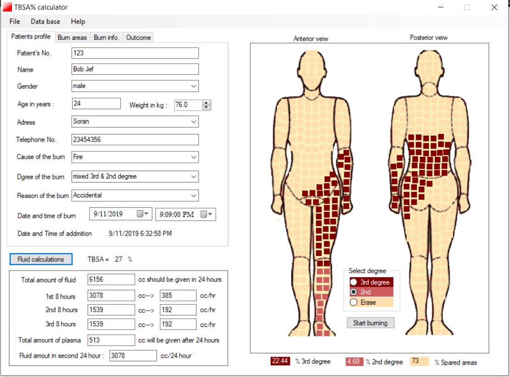

# burn_app
Calculates total surface body area of the burn according to the rule of 9. It also calculates the total fluid replacement needed for the patient if necessary.
--------------------------------------------------------

 
